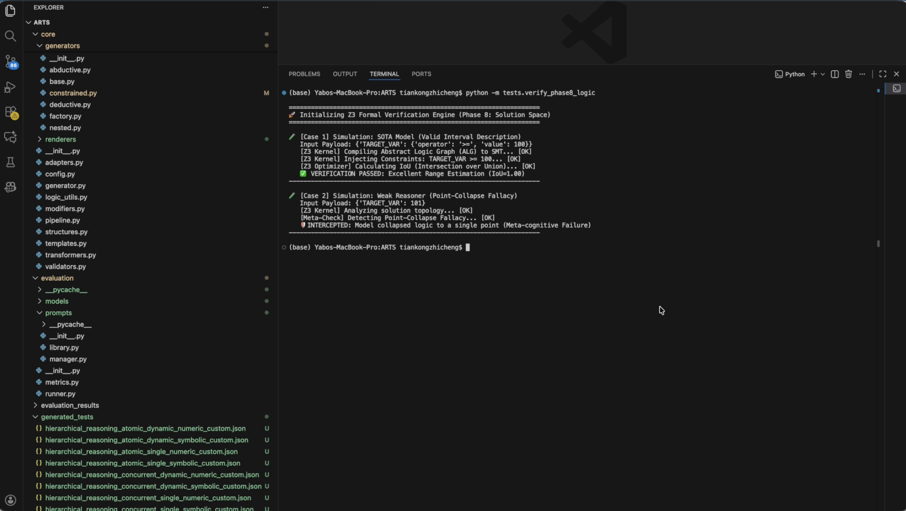
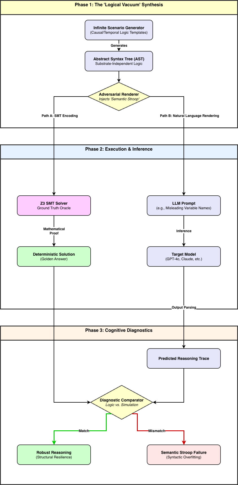

# ARTS-Framework

[-important)](https://neurips.cc/)
[](https://www.python.org/)
[](https://github.com/Z3Prover/z3)

**A Diagnostic Benchmark for Evaluating Pure LLM Reasoning Capabilities using Formal Verification (Z3) and Constraint-Based Synthesis.**

---

[](https://youtu.be/Los9ZUekuf0)

> 📺 **Click the image above to watch the 1-minute technical demonstration.**

---

## 📖 Resources

* **📄 Honours Dissertation**: [Download PDF (Draft)](paper/YaboWang_Honours_Dissertation.pdf)
    * *Title: A Diagnostic Benchmark and Cognitive Scaffolding for Pure Programmatic Reasoning in Large Language Models*
    * *Institution: University of Auckland*
---

## 🧩 Abstract

**ARTS (Automated Reasoning Testbed Synthesizer)** is a framework designed to evaluate the true logical reasoning capabilities of Large Language Models (LLMs). Unlike static benchmarks (e.g., GSM8K) that suffer from data contamination, ARTS generates **dynamic, contamination-free reasoning tasks** on the fly.

Key innovations include:
1.  **Formal Verification**: Integrated **Z3 SMT Solver** ensures every generated case is mathematically well-posed and solvable.
2.  **Cognitive Scaffolding**: Deconstructs complex reasoning into hierarchical layers to diagnose specific cognitive failures.
3.  **Infinite Evaluation**: Capable of synthesizing infinite unique test cases to prevent memorization.

---

## 🏗️ System Architecture

The framework consists of a generator pipeline, a symbolic verification engine, and an evaluation harness.



*(Figure: The ARTS generation pipeline, illustrating the flow from Abstract Logic Graphs (ALG) to Z3 verification and final narrative synthesis.)*

---

## ⚡ Quick Start

You can run the standalone demonstration script to see the model interface and verification logic in action.

### 1. Installation
```bash
git clone https://github.com/YaboWangCS/ARTS-Framework.git
cd ARTS-Framework
pip install -r requirements.txt
```

### 2. Setup API Keys

Copy the example environment file and add your API keys (e.g., Gemini, OpenAI):
```bash
cp .env.example .env
# Edit .env with your specific keys
```

### 3. Run the Demo

This script demonstrates loading a model, processing a recursive reasoning task, and parsing the output.
```bash
python demo.py
```

## 📂 Repository Structure

* `core/verification/`: **[Core Engine]** Contains the Z3 interface for formal logic validation and constraint solving.
* `core/models/`: **[Model Layer]** Abstract adapters for LLM API interaction (Gemini, GPT, Claude, etc.).
* `examples/`: **[Data]** Real-world benchmark samples generated by the framework (JSON format).
* `paper/`: **[Academic]** Contains the Honours dissertation and related research documents.
* `assets/`: **[Visuals]** Architecture diagrams and demonstration media.
* `demo.py`: **[Entry Point]** A lightweight script to demonstrate the evaluation flow.

---

## ⚖️ License

This project is licensed under the MIT License - see the [LICENSE](LICENSE) file for details.

---

*Author: Yabo Wang*